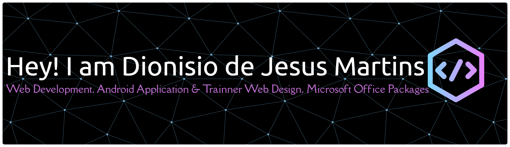

  

- 🔭 I’m currently working on [Microsoft Office Packages Trainner]()

- 🌱 I’m currently learning **Codeigniter**

- 👯 I’m looking to collaborate on [GIS for Village Location in Administrative Post in Ermera](https://finalcourse.id)

- 🤝 I’m looking for help with [GIS for Course Locations in Aileu](https://sigkursus.finalcourse.id)

- 👨‍💻 All of my projects are available at [https://portofolio.finalcourse.id](https://portofolio.finalcourse.id)

- 📝 I regularly write articles on [https://dionisiodjmcs.blogspot.com](https://dionisiodjmcs.blogspot.com)

- 💬 Ask me about **PHP, MySQL**

- 📫 How to reach me **dionisiodjmartins@gmail.com**

- 📄 Know about my experiences [https://portofolio.finalcourse.id](https://portofolio.finalcourse.id)

- ⚡ Fun fact **I can help You to Build Your Portofolio and Website Company**

<h3 align="left">Connect with me:</h3>

<h3 align="left">Languages and Tools:</h3>

               

&nbsp;

